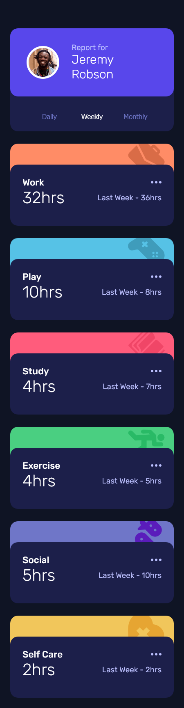
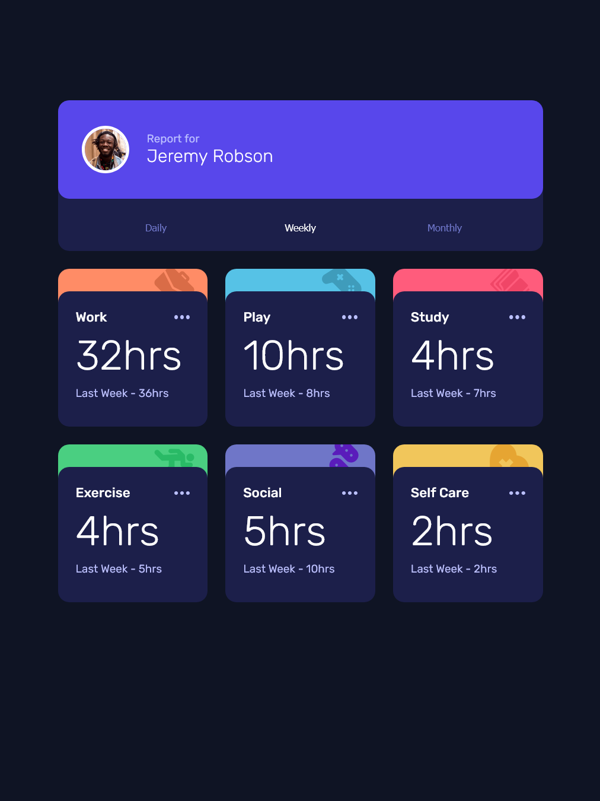
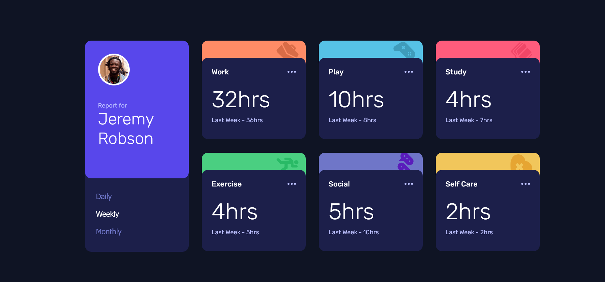
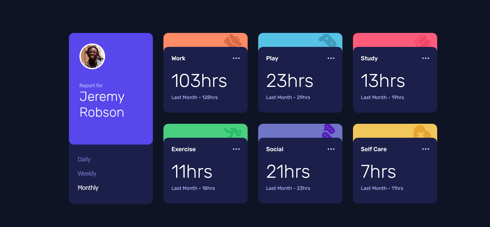

# Frontend Mentor - Time tracking dashboard solution

This is a solution to the [Time tracking dashboard challenge on Frontend Mentor](https://www.frontendmentor.io/challenges/time-tracking-dashboard-UIQ7167Jw).

## Table of contents

- [Overview](#overview)
  - [The challenge](#the-challenge)
  - [Screenshots](#screenshots)
  - [Links](#links)
- [My process](#my-process)
  - [Built with](#built-with)
  - [What I learned](#what-i-learned)
  - [Continued development](#continued-development)
  - [Useful resources](#useful-resources)
- [Author](#author)

## Overview

### The challenge

Users should be able to:

- View the optimal layout for the site depending on their device's screen size
- See hover states for all interactive elements on the page
- Switch between viewing Daily, Weekly, and Monthly stats

### Screenshots

**Figure 1: Mobile View**

**Figure 2: Tablet View**

**Figure 3: Desktop View**

**Figure 4: Daily Active view**

**Figure 5: Monthly Active View**

### Links

- Solution URL: [Click here to view the solution on frontend mentor](https://www.frontendmentor.io/solutions/time-tracking-dashboard-HvqvyZtmH_)
- Live Site URL: [Click here to view the live site](https://charley95.github.io/time-tracking-dashboard/)

## My process

### Built with

- Semantic HTML5 markup
- CSS custom properties
- Flexbox
- CSS Grid
- Mobile-first workflow
- JavaScript 

### What I learned

This challenge was a great way to get more practice on my css grid skills. More importantly, I got to work with JSON file for the first time and glad I got it to work after so many research and study.

### Continued development

I will love to continue practicing on working with JSON in JavaScript as I have not fully gotten a grasp of it.

### Useful resources

- [W3Schools](https://www.w3schools.com)
- [YouTube](https://www.youtube.com)
- [Google](https://www.google.com)
- [Udemy](https://www.udemy.com)

## Author

- Frontend Mentor - [@Charley95](https://www.frontendmentor.io/profile/Charley95)
- github - [Charley95](https://github.com/Charley95)

